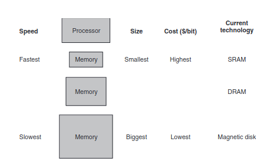

# Memoria y cache

Principio de localidad dice que los programas acceden a relaitivamente pqueñas porciones de memoria del _Adress Space_ de los programas en cualquier instante. 2 tipos de localidad

## Localidad Temporal

    Si un item es referenciado, es probable que sea referenciado nuevamente en un futuro cercano.

## Localidad Espacial

    Si un item es referenciado, es probable que items cercanos sean referenciados en un futuro cercano.

Para poder aprovechar los principios de localidad se implementa una jerarquia de memoria. Que es una estructura que usa multiples niveles de memorias, tal que a medida que la distancia al procesador aumenta, aumenta el tamaño de la memoria y el tiempo de acceso a la misma. 

Mientras mas rapido sean las memorias mas caras por bit son.

La informacion esta siempre guardada en el nivel mas bajo, y la informacion contenida en los niveles mas altos son subconjuntos de la informacion contenida en el nivel mas bajo.

## Cache

La cache es el bloque de memoria mas rapido mas cercano al procesador. La cache es un buffer de memoria que almacena temporalmente los datos que son usados frecuentemente. 

En la cache un **Bloque** (o linea) es la unidad minima de informacion que puede estar presente en el cache. 

Si una informacion que requiere el procesador la encuentra en la cache, se considera un _hit_. Si no se encuentra en la cache, se considera un _miss_, y en este caso se accede a los niveles mas bajos de memoria para obtener la informacion deseada. 

**Hit rate** es la fraccion de accesos a la cache que resultan en un hit.

**Miss rate** es la fraccion de accesos a la cache que resultan en un miss.(1 - Hit rate o Misses / Accesses)

**Hit time** es el tiempo requerido para acceder a la cache y determinar si el acceso es un hit o un miss.

**Miss penalty** es el tiempo requerido para remplazar un bloque de la cache con el bloque deseado de la memoria principal + el tiempo de enviarlo al procesador.

Como el cache es memoria mas rapida, el hit time es mucho mas rapido que el tiempo de acceder a la memoria principal.

SRAM es la memoria utilizada en la cache, tiene un solo puerto de acceso que provee un _read_ o un _write_. Tiene un tiempo de acceso fijo a cualquier direccion de memoria.

### Cache Mapping

La cache esta basada en una estructura _direct-mapped cache_ que es una estructura donde cada direccion de memoria tiene un unico lugar en la cache donde puede ser almacenado. Para poder encontrar la ubicacion de la cache de una direccion de memoria se hace:

    (Direccion de memoria) modulo (Numero de bloques en la cache)

Por ejemplo si una cache tiene 8(2^3) bloques, entonces solamente utiliza los ultimos 3 bits de la direccion de memoria para encontrar la ubicacion del bloque en la cache. (esos 3 bits seran el indice en la cache)

Una _line_ de cache esta compuesta por

        (Tag, Valid bit, Data)
El tag es un campo que identifica la direccion de memoria del bloque almacenado en la cache. El valid bit indica si el bloque es valido o no. El data es el bloque de memoria que se almacena en la linea de cache.

Existen diferentes formas de mapear los bloques de memoria en la cache

### Direct Mapped Cache

Cada bloque de memoria tiene un unico lugar en la cache donde puede ser almacenado. Para encontrar la ubicacion de la cache de una direccion de memoria se hace:

    (Direccion de memoria) modulo (Numero de bloques en la cache)

### Set Associative Cache

Cada bloque de memoria puede ser almacenado en un subconjunto de la cache. Para encontrar la ubicacion de la cache de una direccion de memoria se hace:

    (Direccion de memoria) modulo (Numero de sets en la cache)

Como el bloque puede estar colocado en cualquier elemento de su set corresopndiente, se deben buscar todas las tags de los elementos del set.

### Fully Associative Cache

Cada bloque de memoria puede ser almacenado en cualquier lugar de la cache. Para poder encontrar su ubicacion en la cache, se mapea cada linea de la misma.

### AMAT (Average Memory Access Time)

Es el tiempo promedio de acceso a la memoria. Se calcula como:

    AMAT = Hit time + Miss rate * Miss penalty

## Handling writes

#### Write through
Un esquema donde los write siempre actualizan el cache y el siguiente nivel de memoria , asegurando que la información siempre es consistente en ambos lados.

#### Write buffer
Otra alternativa es mantener un **write buffer**, donde se guarda toda la informacion que se espera guardar en memoria. Luego de que la informacion es escrita en la cache y en el write buffer, el procesador continua su ejecucion. Luego toda esa informacion se escribira junta en memoria y se liberara el buffer.
Cuando el buffer esta lleno y el procesador quiere efectuar un write, debe hacer _stall_ hasta que se libere el buffer y recien ahi puede escribir.

#### Write-back
Cuando un write ocurre, solo es escrito en la linea de la cache, y esta informacion se escribira en memoria solo cuando esa linea de memoria quiera ser reemplazada. Es mas rapido cuando un procesador genera writes igual o mas rapido de lo que pueden ser procesados. Pero es mas costoso y complejo.  

