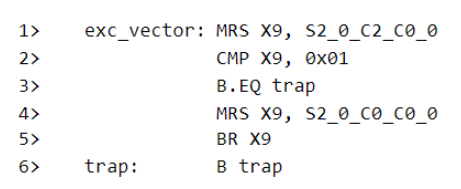
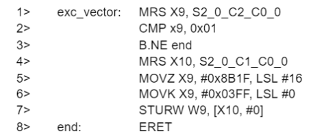
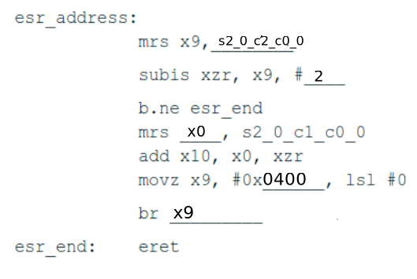
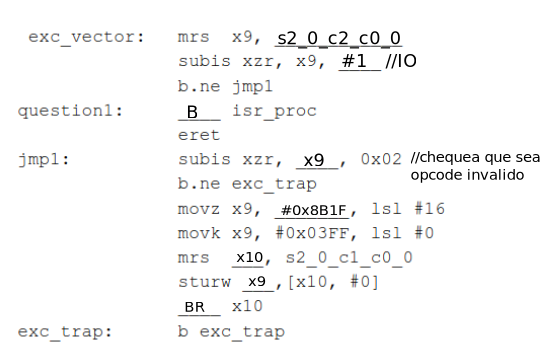

# Practico 3

### Ejercicio 4

Analizar el comportamiento del procesador con manejo de excepciones implementado y responder con V (verdadero) o F (falso) a las siguientes afirmaciones. En caso de ser falsa, elaborar la respuesta correcta:

a) La ocurrencia de una excepción en un procesador causa que la ejecución secuencial del código se vea interrumpida necesariamente. V

La ocurrencia de una excepcion hace que el procesador salte incondicionalmente a una rutina de manejo de excepciones por lo que frena con el flujo del programa. Lo que genera que la secuencialidad se vea interrumpida.

b) La diferencia entre un evento de interrupción y de excepción es que la primera es causada por un recurso del procesador, mientras que la segunda se trata de un evento proveniente de un controlador de E/S externo. F

La diferencia entre interrupcion y excepcion es que:

- Interrupcion: es un evento generado por un controlador I/O externo.
- Excepcion: es un evento generado por el procesador.(overflow de ALU)

c) Los registros de excepción son utilizados típicamente en la ISR o ESR (Interrupt /Exception Service Routine) para poder procesar debidamente el evento ocurrido. **V**

d) La dirección donde se aloja la ISR (vector de interrupciones) es fija sólo si el sistema posee solo un módulo de E/S que genera interrupción. **F**

La direccion donde se aloja la ISR dependera de una decision de diseño. Se podria utilizar la direccion vectorizada en un sistema con un solo modulo E/S.

e) El registro ESR (Exception Syndrome Register) contiene una referencia a la dirección de memoria de la instrucción en ejecución al momento de la ocurrencia de la excepción. **F**

El ESR contiene informacion sobre *porque* se dio la excepcion.

f) Si un procesador no reconoce una instrucción se genera un evento de excepción. **V**

Un opcode invalido es una de las posibles excepciones de un CPU.

g) Que una fuente de interrupción externa sea “enmascarable” significa que el procesador puede retrasar su ejecución si tiene eventos de mayor prioridad pendientes.**F**

Que una fuente de interrupcion sea "enmascarable" significa que el programador puede modificar un bit para que asi el CPU ignore las solicitudes de interrupcion de esa fuente.

h) La instrucción ERET (Exception Return) retorna a la posición del PC (Program Counter) al momento de la excepción más cuatro (PC excepción + 4).**F**

La instruccion ERET retorna a la posicion guardada en el ERR (Exception Return Register) que es la direccion de la proxima instruccion que se hubiese ejecutado, lo cual podria ser un PC+4 o una direccion de branch.

### Ejercicio 5

Considere que la siguiente sección de código está presente en el vector de excepciones
del procesador implementado.

Seleccionar las respuestas correctas de las siguientes afirmaciones:

01. “Ante la ocurrencia de una excepción, el código queda atrapado en un lazo infinito…”  

        a. … solo si se trata de una excepción de OpCode invalido.

        b. … solo si se trata de una excepción por interrupción externa. <--

        c. … siempre, independientemente del tipo de excepción.

        d. Ninguna de las anteriores es correcta

2. “Si suponemos que la instrucción de la línea 2> está corrompida en memoria de forma permanente (generando un OpCode invalido), considerando la implementación particular de nuestro procesador, el mismo...”:

        a. … no realiza ninguna acción porque ya está en el vector de excepciones y retorna normalmente.

        b. … queda atrapado en el bucle infinito del label “trap”.

        c. … genera un comportamiento impredecible, porque este caso no está contemplado en la lógica de excepciones.

        d. Ninguno de los anteriores es correcta <--

        El procesador al detectar un opcode invalido volveria a la linea inicial del ISR, y volveria a ejecutarse las lineas 1 y 2, y quedaria en un bucle infinito. pero no por el bucle de trap.
3. “Este código retorna a la dirección de memoria donde se encuentra …”:

        a. … la instrucción que generó la excepción por OpCode invalido
        
        b. … la siguiente instrucción que debía ejecutarse de no haberse producido la excepción por OpCode invalido.<--
        
        c. … la instrucción que estaba en ejecución al generarse una excepción por interrupción externa.
        
        d. … la siguiente instrucción que debía ejecutarse de no haberse producido una excepción por interrupción externa.

### Ejercicio 6

Considere que la siguiente sección de código está presente en el vector de excepciones del procesador implementado.

Seleccionar las respuestas correctas de las siguientes afirmaciones:

01. “Ante la ocurrencia de una excepción por OpCode invalido, este código... ”

        a. … siempre retorna a la dirección de memoria de la instrucción que generó la excepción + 4. <-- Como es un opcode invalido, no se puede haber guardado una condicion de branch. Por lo tanto, se ejecuta la siguiente instruccion.
        
        b. … reemplaza la instrucción corrupta que generó la excepción por una instrucción válida.
        
        c. Ninguna es correcta
        
        d. Ambas son correctas.
2. “Si suponemos que la instrucción de la línea 3> está corrompida en memoria de forma permanente (generando un OpCode invalido), considerando la implementación particular de nuestro procesador, el mismo...”

        a. … genera un comportamiento impredecible, porque este caso no está
        contemplado en la lógica de excepciones.
        b. … queda atrapado en el bucle infinito. <--
        c. … no realiza ninguna acción porque ya está en el vector de excepciones y retorna normalmente.
        d. Ninguna de los anteriores es correcta.

3. “Ante la ocurrencia de una excepción por interrupción externa, este código... ”

        a. … no realiza ninguna acción.

        b. … siempre retorna a la dirección de memoria de la instrucción que generó la excepción + 4. <--

        c. Ambas son correctas.

        d. Ninguna es correcta

### Ejercicio 7

Considere que la siguiente sección de código está presente en el vector de excepciones del procesador implementado. En el caso de una excepción por OpCode invalido, este código deberá ejecutar un procedimiento alojado en la dirección 0x0400, usando X0 como argumento que contenga la dirección del OpCode invalido.
Completar el código con los argumentos faltantes:

### Ejercicio 8

Considere que la siguiente sección de código está presente en el vector de excepciones de un microprocesador LEGv8 (ISA completa), con el mismo tratamiento de excepciones utilizado hasta el momento.

- En el caso de una excepción por Interrupción externa (IRQ), este código deberá ejecutar la ISR alojada en la dirección con etiqueta “isr_proc”. Una vez que se retorne de la ISR, se debe retomar el flujo original del programa previo a la ocurrencia de la interrupción.
- En caso de un OpCode invalido se debe reemplazar el contenido de la memoria
que contiene la instrucción corrompida con el valor 0x8B1F03FF. Luego se debe
forzar la ejecución de este nuevo OpCode.
- Cualquier otra fuente de excepción el procesador debe quedar atrapado en un lazo infinito dentro del vector de excepciones.

1. Completar el código con los argumentos faltantes.

    

    Que hace?
    Primero chequea que el tipo de excepcion sea IRQ, si es asi, salta a la ISR. Si no es IRQ, chequea si es un opcode invalido, si es asi, reemplaza el opcode invalido por el valor 0x8B1F03FF y lo ejecuta. Si no es IRQ ni opcode invalido, se queda en un lazo infinito.

2. Seleccionar todas las respuestas correctas de las siguientes afirmaciones:

   a. Si suponemos que la posición de la etiqueta “question1” está corrompida en memoria de forma permanente (generando un OpCode invalido), considerando la implementación particular de nuestro procesador:

        i. Ante una excepción por IRQ queda atrapado en un bucle infinito.
        
        ii. Ante una excepción por OpCode Invalido queda atrapado en un bucle
        infinito.
        
        iii. Se genera un comportamiento impredecible ante cualquier excepción,
        porque este caso no está contemplado en la lógica de excepciones.
        
        iv. No se realiza ninguna acción porque ya está en el vector de
        excepciones y retorna normalmente.
        
        v. En cualquier caso se reemplaza el OpCode Invalido y se retorna al
        flujo original del programa, previo a la ocurrencia de la primera
        interrupción.
        
        vi. Ninguna es correcta, ya que la lógica dependerá del tipo de
        excepción.

    b. Ante la ocurrencia de una excepción por OpCode invalido, este código...

        i. no es posible para el procesador determinar la dirección de retorno para este contexto.
        ii. siempre queda atrapado en el lazo “exc_trap”.
        iii. siempre retorna a la dirección de memoria de la instrucción que generó la excepción + 4.
        iv. siempre retorna a la dirección de memoria de la instrucción que generó la excepción.
        v. Ninguna es correcta
