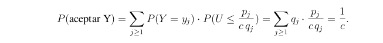

# Generacion de variables aleatorias discretas

Existen 2 formas de generar variables aleatorias discretas:

- metodo de la transformada inversa
- metodo de aceptacion y rechazo.

## Metodo de la transformada inversa

Se basa en la inversa de la funcion de distribucion acomulada. Debemos establecer una correspondencia biunivoca entre ciertos subintervalos de [0,1) y los valores de la variable aleatoria X. La correspondencia se establece de la siguiente manera:
$$
x_0  \rightarrow I_0 = [0, p_0) \\
x_1  \rightarrow I_1 = [p_0, p_0 + p_1) \\
x_2  \rightarrow I_2 = [p_0 + p_1, p_0 + p_1 + p_2) \\
\vdots \\
x_n  \rightarrow I_n = [p_0 + p_1 + \cdots + p_{n-1}, 1)
$$

De modo que entonces generando alguna valor de una variable aleatoria uniforme, y segun a que intervalo pertenece es el valor de X que se genera. 

```python
# x: valores de la variable aleatoria
# p: probabilidades de los valores de la variable aleatoria
def discretaX(p, x):
    u = random()
    i = 0
    F = p[0]
    while u >= F:
        i += 1
        F += p[i]
    return x[i]
```

Una posible mejora para el agoritmo es ordenar las probabilidades de mayor a menor (junto con sus valores esperados) para asi reducir la cantidad de comparaciones que se deben hacer.

### Generacion uniforme discreta

si X tiene distribucion uniforme discreta en {1,...,n} entonces $p_n = 1/n$. Entonces el algoritmo es:

```python
def uniformeDiscreta(n):
    return int(random() * n) + 1
```

Si queremos generar una uniforme con valores entre [m, k] entonces debemos simplemente generar valores entre 1 y k-m +1 y sumarles m-1.

```python
def uniformeDiscreta(m, k):
    return int(random() * (k - m + 1)) + m
```

#### Generacion de permutaciones

Un uso de generar variables aleatorias unfiormes es para poder generar permutaciones aleatorias de un arreglo.La idea consiste en intercambiar el valor $a_n$ con algun valor en {$a_n,\cdots,a_{N-1}$} y luego intercambiar $a_{N-2}$ con algun valor de {$a_{N-2}, a_{N-1}$}

```python
def permutacion(a): #a=[a[0], a[1], ..., a[N-1]]
    N = len(a)
    for j in range(N-1):
        indice = int((N-j) * random()) + j
        a[j], a[indice] = a[indice], a[j]
    return a
```

Para hacerlo mas eficiente podemos comenzar a recorrer el arreglo desde atras para adelante. Y queda:

```python
def permutacion(a): #a=[a[0],a[1],...,a[N-1]]
    N = len(a)
    for j in range(N-1,0,-1):
        indice = int((j+1) * random())
        a[j], a[indice] = a[indice], a[j]
```

Esto tambien sirve para obtener un subconjunto aleatorio de un conjunto de N elementos.

```python
def subcAleatorio(r,A):
    N = len(A)
    for j in range(N-1, N-1-r, -1):
        indice = int((j+1) * random())
        A[j], A[indice] = A[indice], A[j]
    return A[N-r:]
```

### Generacion de geométrica

Una variable aleatoria geometrica con parametro p tiene una probabilidad de masa dada por:

$$ p_i = P(X = i) = p(1-p)^{i-1} \quad i \geq 1$$

Y su funcion de distribucion acomulada es:

$$ F(j-1) = P(X \leq j-1) = 1 - (1-p)^j$$

Entonces el metodo tinversa asigna valor X = j si $U \in [1 - (1-p)^(j-1), 1 - (1-p)^j)$. Dado que las potencias de q son decrecientes entonces X es el minimo exponente de q que sea menor que 1-U.Y tomando el logaritmo obtenemos:

```python
def geometrica(p):
    return int(log(1-random())/log(1-p)) + 1
```

### Generacion de Bernoulli

```python
def bernoulli(p):
    return 1 if random() < p else 0
```

Si queremos generar N Bernoulli(p), bastacon saber que una Geometrica(p) es la variable que mide el numero de ensayos independientes de una Bernoulli(p) hasta obtener un exito. Entonces podemos generar N Bernoulli(p) generando Geometricas(p).

```python
def Nbernoulli(N,p):
    Bernoullis = [0] * N
    j = geometrica(p) - 1
    while j < N:
        Bernoullis[j] = 1
        j += geometrica(p)
    return Bernoullis
```

### Generacion de Poisson

La distribucion de Poisson con parametro $\lambda$ tiene una probabilidad de masa dada por:
$$ p_i = P(X = i) = \frac{\lambda^i}{i!}e^{-\lambda} \quad i \geq 0$$
Y las probabilidades cumplen una relacion de recurrencia:
$$ p_{i+1} = \frac{\lambda}{i+1}p_i$$

```python
def poisson(lamda):
    i = 0
    p = exp(-lamda)
    F = p
    u = random()
    while u >= F:
        i += 1
        p *= lamda / i
        F += p
    return i
```

Como el valor mas probable a generar es $\lambda$ entonces podemos partir a buscar desde ahi, para arriba o para abajo dependiendo del valor generado por U.

```python
def Poisson(lamda):
    p = exp(-lamda)
    F = p
    for j in range(1, int(lamda) + 1):
        p *= lamda / j
        F += p
    u = random()
    if u >= F:
        j = int(lamda) + 1
        while u >= F:
            p *= lamda / j
            F += p
            j += 1
        return j - 1
    else:
        j = int(lamda)
        while u < F:
            F -= p
            p *= j / lamda
            j -= 1
        return j+1
```

### Generacion de binomial

Si X ~ Binomial(n,p) entonces la formula recursiva para las probabilidades esta dada por:
$$ p_0 = (1-p)^n \quad p_{i+1} = \frac{n-1}{1+1}\frac{p}{1-p}p_i$$

Y un algoritmo posible es:

```python
def Binomial(n,p):
    c = p/(1-p)
    prob = (1-p)**n
    F = prob
    i = 0
    u = random()
    while u >= F:
        prob *= c * (n-i)/(i+1)
        F += prob
        i += 1
    return i
```

---

## Metodo de aceptacion y rechazo

El metodo de aceptacion y rechazo para generar una variable aleatoria X supone que podemos generar una variable aleatoria Y que cumpla lo siguiente:

- Si $P(X = x_j)$ entonces $P(Y = x_j) > 0$, para todo $x_j$ en el rango de X.
- Existe una constante c > 0, tal que 
$$\frac{P(X = x_j)}{P(Y = x_j)}\leq c$$
Si denotamos $p_j = P(X = x_j) y q_j = P(X = q_j)$ entonces obtenemos que:
$$\sum_{j \geq 1} p_j \leq c \cdot \sum_{j \geq 1}q_j \leq c$$

Entonces asumimos c > 1 y 1/c < 1. 

```python
Simular Y
u = random()
if u < p(Y) / c * q(Y):
    return Y
else:
    volver a simular Y
```
Se comporta como una variable geometrica ya que repite hasta tener un exito.

La probabilidad de generar algun valor de X es la probabilidad de aceptar el valor de Y en esa iteracion.


Y tambien tenemos que la probabilidad de generar algun valor $x_j$ de X es:


Por lo tanto vemos que el numero de iteraciones del algoritmo hasta aceptar el valor de Y es una distribucion geometrica con probabilidad de exito 1/c y fracaso 1 - 1/c

Para poder tomar esta cota c, debo encontrar el valor maximo que puede tomar la funcion $f(x) = \frac{p(x)}{q(x)}$ para todo x en el rango de X. Esto, como son variables discretas, lo debo analizar viendo cuales son los posibles valores de cada una.

---

## Metodo de composicion

La idea de la composicion es cuando una variable aleatoria tiene cierta probabilidad de ser de un tipo y otra probabilidad de ser de otro tipo. $P(X = j) = \alpha p_j + (1-\alpha)q_j$ donde $\alpha$ es la probabilidad de que sea de tipo p y $1-\alpha$ es la probabilidad de que sea de tipo q. Y ademas $P(X_1 = x_j) = p_j$ y $P(X_2 = x_j) = q_j$.

Entonces puedo generar los valores de X de la siguiente manera:

```python
def composicion(alpha):
    u = random()
    if u < alpha:
        return X1()
    else:
        return X2()
```

## Metodo de la urna

Es un metodo sencillo, sea una variable aleatoria X que toma un numero finito de valores, entonces debo considerar un valor $k \in \N$ tal que $kp_j$ sea entero. Ahora considero un arreglo A de k posiciones y almaceno cada valor $i$ en $kp_i$ posiciones de A. Luego genero un valor aleatorio entre 1 y k y devuelvo el valor que esta en esa posicion de A.

```python
def urnaX(A):
    I = int(random() * len(A))
    return A[I]
```
