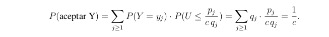
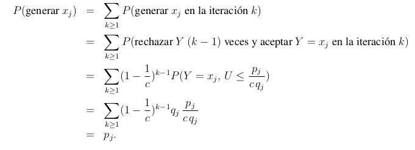

# Generacion de variables aleatorias discretas

Existen 2 formas de generar variables aleatorias discretas:

- metodo de la transformada inversa
- metodo de aceptacion y rechazo.

## Metodo de la transformada inversa

---

## Metodo de aceptacion y rechazo

El metodo de aceptacion y rechazo para generar una variable aleatoria X supone que podemos generar una variable aleatoria Y que cumpla lo siguiente:

- Si $P(X = x_j)$ entonces $P(Y = x_j) > 0$, para todo $x_j$ en el rango de X.
- Existe una constante c > 0, tal que 
$$\frac{P(X = x_j)}{P(Y = x_j)}\leq c$$
Si denotamos $p_j = P(X = x_j) y q_j = P(X = q_j)$ entonces obtenemos que:
$$\sum_{j \geq 1} p_j \leq c \cdot \sum_{j \geq 1}q_j \leq c$$

Entonces asumimos c > 1 y 1/c < 1. 

```python
Simular Y
u = random()
if u < p(Y) / c * q(Y):
    return Y
else:
    volver a simular Y
```
Se comporta como una variable geometrica ya que repite hasta tener un exito.

La probabilidad de generar algun valor de X es la probabilidad de aceptar el valor de Y en esa iteracion.


Y tambien tenemos que la probabilidad de generar algun valor $x_j$ de X es:


Por lo tanto vemos que el numero de iteraciones del algoritmo hasta aceptar el valor de Y es una distribucion geometrica con probabilidad de exito 1/c y fracaso 1 - 1/c
