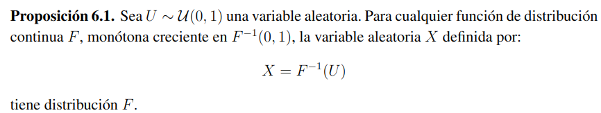
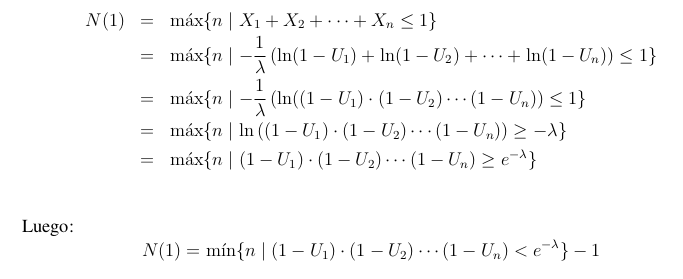
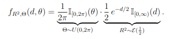

# Generación de variables aleatorias continuas

## Metodo de la transformada inversa

Este metodo requiere de conocer la funcion de distribución acomulada de la variable X a simular. Si X es absolutamente continua y _f_ es su función de densidad, entonces su función de distribución acumulada es:
$$ \int_{-\inf}^{x} f(t)dt $$

Vamos trabajar sobre las variables X tal que su f.d.m sea monótona creciente sobre el conjunto
$F^{-1}(0,1) ={x| 0 \lt F(X) \lt 1}$. De esta forma nos aseguramos que F(x) sea invertible en el (0,1).



Con esta proposicion podemos dar un algoritmo basico de como funciona el metodo de la transformada inversa:

```python
def Tinversa():
    u = random()
    return G(U) # G = F^-1
```

Eso no siempre es posible ya que puede ser que $F^{-1}$ involucre funciones costosas o que no se pueda calcular explicitamente. En estos casos se busca expresar F como:

- distribucion del minimo o del maximo de VA indep
- suma de variables indep
- distribuciones condicionales, etc.

### Simulacion de variable Exponencial

Si X es una variable aleatoria con distribucion exponencial de parametro $\lambda = 1$ entonces su funcion de densidad es:
$$
F(x) = \begin{cases}
        1 - e^{-x} \quad \text{si  } x \gt 0 \\
        0  \quad \text{si  } x \le 0
        \end{cases}
$$

luego la inversa de F sobre (0,1) es:
$$
F^{-1}(u) = -\log(1-u) , u \in (0,1)
$$

Entonces el algoritmo de simulacion para una exponencial con $\lambda = 1$ es:

```python
def exponencial ():
    u = 1 - random()
    return -log(1-u)
```

Vemos que si Y es $\frac{1}{\lambda} X$ entonces Y distribuye exponencial con parametro $\lambda$ y el codigo es:

```python
def exponencial (lamda):
    u = 1 - random()
    return -log(1-u)/lamda
```

### Simulacion de variable Poisson

Sabemos que en un proceso de Poisson de intensidad $\lambda$ entonces N(t), es una variable aleatoria Poisson con media $\lambda . t$. Y ademas sabemos que el tiempo entre llegadas de eventos son aleatorias exponenciales con media $\frac{1}{\lambda}$.

N(1) es una variable Poisson con paramentro $\lambda$, y sabemos que los tiempos entre arribos en [0,1] son exponenciales. Entonces si simulamos _i_ variables aleatorias de modo que:
$$
X_1+X_2+..+X_n \leq 1 \text{ y } X_1+X_2+..+X_n+X_{n+1} \gt 1
$$
Entonces n es el número de arribos hasta t=1. Y tenemos



```python
def poisson_con_exp(lamda):
    X = 0
    producto = 1 - random()
    cota = exp(1-lamda)
    while producto >= cota:
        producto *= 1 - random
        x += 1
    return x
```

### Simulacion de variable Gamma(n, $\lambda^{-1}$)

Sabemos que la suma de n variables aleatorias exponenciales, independientes, con parametro $\lambda$ es una variable aleatoria con distribucion Gamma(n, $\lambda^{-1}$). Esta propiedad nos permite dar un algoritmo que a partir de exponenciales generamos una Gamma.

$$X = -\frac{1}{\lambda} \log(U_1 \cdot U_2 \cdots U_n)$$

Y el algoritmo es:

```python
def Gamma(n, lamda):
    # genera gamma con parametros n y 1/lamda
    u = 1
    for _ in range(n):
        u *= 1 - random()
    return -log(u)/lamda
```

utilizando este metodo de generacion de exponenciales para generar una gamma, entonces podemos diseñar un algoritmo para generar n variables independientes exponenciales de parametro $\lambda$

```python
def DosExp(lamda):
    V1, V2 = 1-random(), 1-random()
    t = -log(V1 * V2) / lamda
    U = random()
    X = t * U
    Y = t - X
    return X, Y
```

Para el caso general tenemos que calcular un unico logaritmo y n-1 uniformes adicioneles.

```python
def Nexponenciales(n,lamda):
    t = 1
    for _ in range(n): t *= random()
    t = -log(t)/lamda
    unif = random.uniform(0,1,n-1)
    unif.sort()
    exponenciales = [unif[0]*t]
    for i in range(n-2):
        exponenciales.append((unif[i+1]-unif[i])*t)
    
    exponenciales.append((1-unif[n-2])*t)
    return exponenciales
```

---

## Metodo de aceptacion y rechazo

Supongamos que queremos generar X que tiene funcion de densidad _f_:
$$F(x) = P(X \leq x) = \int_{-\inf}^{x} f(t)dt$$

Y que tengo un método para generar otra Y con denssidad _g_ tq:
$$\frac{f(y)}{g(y)} \leq c \quad\text{ para todo } y \in \R : f(y) \not ={0}$$

Entonces el algoritmo de aceptacion y rechazo es:

```python
def AceptacionRechazo():
    while True:
        y = G()
        u = random()
        if u < f(y) / (c*g(y)):
            return y
```

Al igual que en las variables aleatorias discretas, este metodo tiene densidad _f_ y el numero de iteraciones es una variable geometrica con media _c_.

Para poder generar X rechazando contra una variable Y debemos poder acotar $\frac{f(x)}{g(x)}$ con una constante c. Por lo que vamos a tener que considerar la funcion:
$$
h(x) = \frac{f(x)}{g(x)}, \quad \text{para } x \in \R : f(x) \not = 0
$$

Para esto vamos a:

- encontrar los puntos criticos de h(x) (donde h'(x) = 0 o h(x) no esta definida)
- ver cuales corresponden a máximos locales
- Luego tomamos ese maximo como _**c**_

## Simulacion de variables aleatorias normales

### Por composicion usando |Z|

TODO

### Metodo polar

En el metodo polar lo que se busca es generar dos variables normales a partir de las coordenadas polares de un punto (X,Y) en el plano, donde ambas son normales estandar e independientes. Entonces tendremos a $R^2 = X^2 + Y^2$ y $\Theta = \arctan(\frac{Y}{X})$. Utilizando el determinante jacobiano de la transformacion de coordenadas polares a cartesianas tenemos que:

$$
f_{R^2, \Theta}(d, \theta) = \frac{1}{2}f_{X,Y}(x,y) = \frac{1}{4\pi}e^{-\frac{d}{2}} \\
$$


```python
def MetodoPolar():
    Rcuadrado = -2 * log(1 - random())
    theta = 2 * pi * random()
    X = sqrt(Rcuadrado) * cos(theta)
    Y = sqrt(Rcuadrado) * sin(theta)
    return X*sigma + mu, Y*sigma + mu
```

### Transformaciones de Box-Muller

TODO

### Método de razón entre uniformes

El metodo de razon entre uniformes busca generar una varaible X con funcion de densidad f tal que:
$$
C_f = \{ (u,v) | 0 \lt u \lt \sqrt{f(v/u)} \}
$$
Si U y V son variables aleatorias continuas tales que (U,V) esta uniformemente distribuido en el conjunto $C_f$ entonces la variable X = V/U tiene funcion de densidad f.

Luego los pasos del algoritmo son los siguientes:

1. Generar un vector aleatorio (U,V) uniformemente en el rectangulo (0, c) x (a, b) que contenga a $C_f$
2. Si $U^2 \lt f(V/U)$ entonces devolver X = V/U, sino volver a 1.

Para el caso de la normal estandar $C_f = \{ (u,v) | 0 \lt u \lt \frac{1}{\sqrt[4]{2\pi}}e^{-v^2/4u^2} \}$

luego un par solo pertenece a $C_f$  si ($C = \sqrt[4]{2\pi}$):
$$
\ln(u \cdot C) \lt -\frac{v^2}{4u^2} \rightarrow 0 \leq v^2 \lt -4u^2 \ln(u \cdot C) \\
\text{Esto requiere que } 0 \lt u \leq \frac{1}{C}. \text{ademas } -4u^2 \ln(u \cdot C) \text{Toma maximo en } u = \frac{e^{-0.5}}{C} \text{ y el valor maximo es } \frac{2}{eC^2}
$$
Esto nos dice que $|v| \lt \frac{2}{C\sqrt{2e} = b}$, y vimos antes que $0 \lt C \cdot u \lt 1$. Entonces $C_f$ esta comprendido en $R = [0,\frac{1}{C}] \times [-b,b]$

```python
from math import exp
NV_MAGICCONST = 4 * exp(-0.5) / sqrt(2.0)
def normalvariate(mu, sigma):
    while 1:
        u1 = random()
        u2 = 1.0 - random()
        z = NV_MAGICCONST * (u1 - 0.5) / u2
        zz = z * z / 4.0
        if zz <= -log(u2):
            break
    return mu + z * sigma
```

## Generación de un proceso de Poisson

TODO
