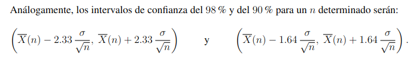

# Análisis estadístico de datos simulados

En general a la hora de realizar simulaciones, tenemos datos obtenidos del sistema real que luego de ser analizamos decidimos representar estos datos de acuerdo con cierta distribucion de probabilidad. Pero estas dependen de ciertos parametros que la determinan ($\lambda$ para la exponencial)y ademas existen ciertas medidas (Esperanza, Varianza, max, min, etc.). Y como por lo general se desconoce la distribucion exacta de X, se **estiman** estos parametros a partir de la muestra.

Un estimador es una funcion que depende de una muestra de valores. Y tiene la siguientes caracteristicas:

- Insesgabilidad: Es insesgado si $E[\hat{\theta}]= \theta$
- Consistencia: Si al aumentar la muestra el estiamdor se aporxima al valor real
- Eficiencia: menor varianza, mayor eficiencia.
- Suficiencia: utiliza toda la información obtenida de la muestra.

## Error cuadrático medio de un estimador

El **error cuadrático medio** de un estimador $\hat{\theta}$ esta definido como:

$$
ECM(\hat{\theta}, \theta) = E[(\hat{\theta} - \theta)^2] \\
= Var(\hat{\theta}) + (E(\hat{\theta}) - \theta)^2
$$

Si el estimador es insesgado su ECM es igual a la varianza.

## Estimadores MV

### Media muestral

Dadas n observaciones $ X_1, X_2, ..., X_n $ la media muestral es:

$$
\overline{X}(n) = \frac{1}{n}(X_1 + X_2 + ... + X_n)
$$
Veamos que es un **estimador insesgado**.

$$
E[\overline{X}(n)] = E[\sum_{i=1}^{n} \frac{X_i}{n}] = \sum_{i=1}^{n} \frac{E[X_i]}{n} = \frac{n\theta}{n} = \theta
$$
Y como es insesgado entonces su ECM es igual a la varianza.

$$
ECM(\overline{X}(n), \theta) = Var(\overline{X}(n)) = \frac{\sigma^2}{n}
$$

---

### Varianza muestral

Si quisieramos dar un estimador para la esperanza, y que este tenga un ECM < 0.001, necesitariamos saber el valor de $\sigma$, pero la gran mayoria de las veces no lo conocemos. Por ello es necesario tener un estiamador para $\sigma^2$(Varianza).

$$
S^2(n) = \frac{1}{n-1} \sum_{i=1}^{n} (X_i - \overline{X}(n))^2 \\
= \frac{1}{n-1} \sum_{i=1}^{n} X_i^2 - n\overline{X}^2
$$

Veamos que es un **estimador insesgado**.

$$
E[X_i^2] = Var(X_i) + E[X_i]^2 = \sigma^2 + \theta^2 \\
E[\overline{X}^2(n)] = Var(\overline{X}(n)) + E[\overline{X}(n)]^2 = \frac{\sigma^2}{n} + \theta^2 \\
(n-1)E[S^2(n)] = nE[X_i^2] - nE[\overline{X}^2(n)] = n(\sigma^2 + \theta^2) - n(\frac{\sigma^2}{n} + \theta^2) = (n-1)\sigma^2 \\
E[S^2(n)] = \sigma^2
$$

Usamos $S(n) = \sqrt{S^2(n)}$ para obtener la desviacion estandar muestral.

### Estimadores en simulaciones

Muchas veces queremos saber cuantas muestras de la poblacion necesitamos para poder obtener un estimador de la media con un ECM menor que cierto $d$. Que deberia satisfacer $\frac{\sigma^2}{n} < d$. Pero no siempre sabemos el valor de $\sigma$, por lo que lo reemplazamos con el estimador $S^2(n)$. Lo que implica qe ambos estimadores deberan ser calculados en cada iteracion con cada nuevo elemento de la muestra que se genera. Por lo que es util tener definiciones recursivas de cada estimador, para que el calculo sea mas eficiente.

$$
\overline{X}(n +1) = \overline{X}(n) + \frac{X_{n+1} - \overline{X}(n)}{n+1} \\
S^2(n+1) = (1 - \frac{1}{n})S^2(n) + (n +1)(\overline{X}(n+1) - \overline{X}(n))^2
$$
De esta forma el estimador de **media muestral** se ira calculando iteradamente hasta que el ECM sea menor que $d$.

```python
def media_muestral(d):
    media = generar_X()
    scuad = 0
    n = 1
    while n <= 100 or sqrt(scuad/n) > d:
        n += 1
        X = generar_X()
        mediaAnt = media
        media = mediaAnt + (X - mediaAnt)/n
        scuad = (1 - 1/(n-1)) * scuad + n*(media - mediaAnt)**2

    return media
```

### Estimador de proporción

Lo usamos cuando queremos estimar una probabilidad. Pra estimar la proporcion usamos $\hat{p} = \overline{X}(n)$. Teniendo en cuenta que la i-esima simulacion se tendra una variable de Bernoulli $X_i$, por lo que la varianza es $\sigma^2 = p(1-p)$ para una Bernoulli. 

El n dependera de la presicion con la que querramos estimar p, esta precision es el ECM:$\frac{\sigma^2}{n}$. Como dijimos que la varianza de una Bernoulli era $p(1-p)$, entonces un estimador para la varianza de la variable simulada es:
$$
\hat{\sigma}^2 = \overline{X}(n)(1 - \overline{X}(n))
$$

Luego el ECM sera : $\frac{\overline{X}(n)(1 - \overline{X}(n))}{n}$

```python
def estimador_p(d):
    p = 0
    n = 0
    while n <= 100 or sqrt(p * (1-p)/n) > d:
        n += 1
        X = generar_X()
        p = p + (X - p)/n

    return p
```

## Estimador por intervalos

Un estimador por intervalo de un parámetro es un intervalo para el que se predice que el parámetro está contenido en él. Es decir, se tiene un intervalo aleatorio con una cierta probabilidad de contener el parámetro buscado. La **confianza** que se da al intervalo es la probabilidad de que el intervalo contenga al parámetro.

### Estimador por intervalo de E(X) = $\theta$

Queremos determinar un intervalo que contenga al parámetro $\theta$ con un nivel de confianza de $1 - \alpha$. Recordamos que $z_{\alpha}$ indica el numero real tal que $P(Z > z_{\alpha}) = \alpha$. Ademas sabemos que:
$$
\frac{\overline{X}(n) - \theta}{\sigma/\sqrt{n}} \sim N(0,1)
$$
luego como tiene una distribución simétrica podemos decir que:
$$
P(\overline{X}(n) - z_{\alpha/2} \frac{\sigma}{\sqrt{n}} \lt \theta \lt \overline{X}(n) + z_{\alpha/2} \frac{\sigma}{\sqrt{n}}) = 1 - \alpha
$$
Determina un intervalo aleatorio que contiene al parametro $\theta$ con una **confianza** de 1 - $\alpha$. Si queremos un intervalo de confianza del 95% entonces $\alpha = 0.05$ y $z_{\alpha/2} = 1.96$. Y el intervalo sera: $[\overline{X}(n) - 1.96 \frac{\sigma}{\sqrt{n}}, \overline{X}(n) + 1.96 \frac{\sigma}{\sqrt{n}}]$



Cuando $\sigma$ es desconocido se reemplaza utilizando el estimador $\hat{\sigma} = \sqrt{S^2(n)}$.

La longitud del intervalo esta dada por: 
$$
l = 2\cdot z_{\alpha/2} \frac{\sigma}{\sqrt{n}} \quad \text{o} \quad l = 2z_{\alpha/2} \frac{S(n)}{\sqrt{n}}
$$
Por lo que si quiero generar un intervalo con menor longitud que L. Generare hasta un n tal que:
$$
2z_{\alpha/2} \frac{S(n)}{\sqrt{n}} < L
$$

```python
def intervalo_media(z_alfa_2, L):
    'Confianza = 1 - alfa, ampliud del intervalo = L'
    d = L/(2*z_alfa_2)
    media = generar_X()
    scuad = 0
    n = 1
    while n <= 100 or sqrt(scuad/n) > d:
        n += 1
        X = generar_X()
        mediaAnt = media
        media = mediaAnt + (X - mediaAnt) / n
        scuad = (1 - 1/(n-1)) * scuad + n*(media - mediaAnt)**2
    return media
```

### Estimador por intervalos de una proporción

En el caso de una Bernoulli, el estimador por intervalos del parametro p tambien es el estimador por intervalos de la media poblacional. y para la varianza es $\overline{X}(n)(1-\overline{X}(n)$. Y para un n grande tenemos que:
$$
\frac{\overline{X}(n) - p}{\sqrt{\frac{\overline{X}(n)(1-\overline{X}(n))}{n}}} = Z \sim N(0,1)
$$
Por lo que un intervalo de confianza del $100(1-\alpha)$% para p es:
$$
(\;
    \overline{X}(n)-z_{\alpha/2}\frac{\sqrt{\overline{X}(n)(1-\overline{X}(n))}}{\sqrt{n}} \; , \;
    \overline{X}(n)+z_{\alpha/2}\frac{\sqrt{\overline{X}(n)(1-\overline{X}(n))}}{\sqrt{n}}
\;)
$$

```python
def intervalo_proporcion(z_alfa_2, L):
    'Confianza = 1 - alfa, ampliud del intervalo = L'
    d = L/(2*z_alfa_2)
    p = 0
    n = 0
    while n <= 100 or sqrt(p * (1-p)/n) > d:
        n += 1
        X = generar_X()
        p = p + (X - p)/n
    return p
```
