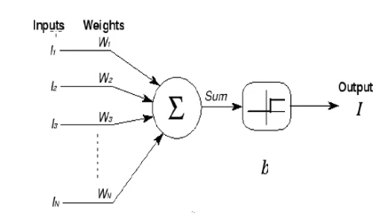

# Redes Neuronales - 2024

La nerona de McCulloch y Pitts (1943)

La neurona toma como inputs las salidas de algunas de las neuronas de la capa anterior, todas ponderadas con algun peso asignado. Luego, esta realiza la suma de cada entrada ponderada con su peso. Y evalua una **funcion de activación** para decidir la salida de la neurona. 

donde 

- $W_i$ es el peso que se le da a la eficacia de esa conexion neuronal

- $I_i$ : señal que proviene de la neurona i

- $b$ : umbral con el que se activara la neurona

- $I$ : Salida de la neurona (1 o 0, para esta funcion de activación por umbral)

$sum = h_i = \sum_{i=1}^N{W_i I_i}$ y si $h_i$ es mayor o menor que el umbral, la neurona se activara o no se activara. 

Diferentes funciones de activación **continuas**

